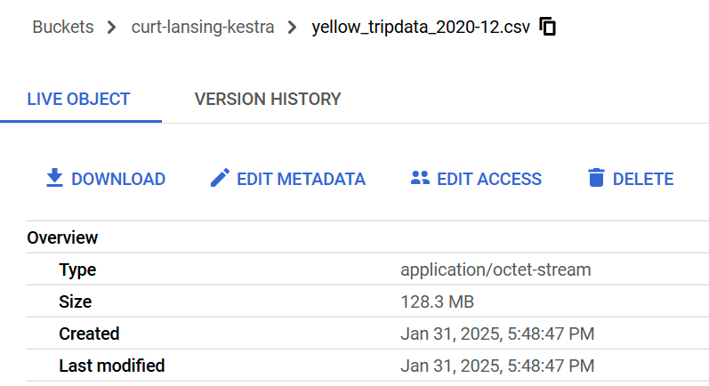
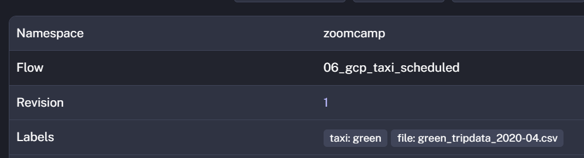

### 1.  Within the execution for Yellow Taxi data for the year 2020 and month 12: what is the uncompressed file size (i.e. the output file yellow_tripdata_2020-12.csv of the extract task)?



#### Answer
128.3 MB


### 2.  What is the rendered value of the variable file when the inputs taxi is set to green, year is set to 2020, and month is set to 04 during execution?



#### green_tripdata_2020-04.csv


### 3.  How many rows are there for the Yellow Taxi data for all CSV files in the year 2020?

```sql
select count(1) as yellowtrip_2020_count
from `kestra-sandbox-449323`.de_zoomcamp.yellow_tripdata
where filename like 'yellow_tripdata_2020-%.csv'
```

#### Answer
24,648,499


### 4.  How many rows are there for the Green Taxi data for all CSV files in the year 2020?

```sql
select count(1) as greentrip_2020_count
from `kestra-sandbox-449323`.de_zoomcamp.green_tripdata
where filename like 'green_tripdata_2020-%.csv'
```

#### Answer
1,734,051


### 5.  How many rows are there for the Yellow Taxi data for the March 2021 CSV file?

```sql
select count(1) as yellowtrip_2020_03_count
from de_zoomcamp.yellow_tripdata
where filename = 'yellow_tripdata_2021-03.csv'
```

#### Answer
1,925,152


### 6.  How would you configure the timezone to New York in a Schedule trigger?

Based on the Kestra documentation found here
https://kestra.io/docs/workflow-components/triggers/schedule-trigger

#### Answer
Add a timezone property set to America/New_York in the Schedule trigger configuration